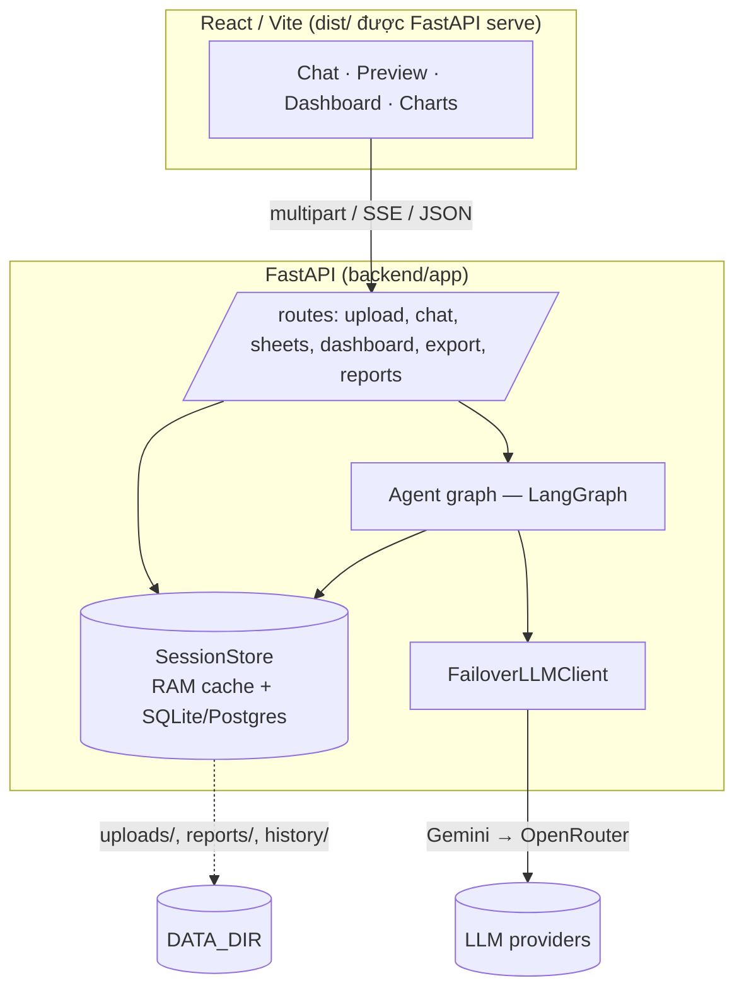
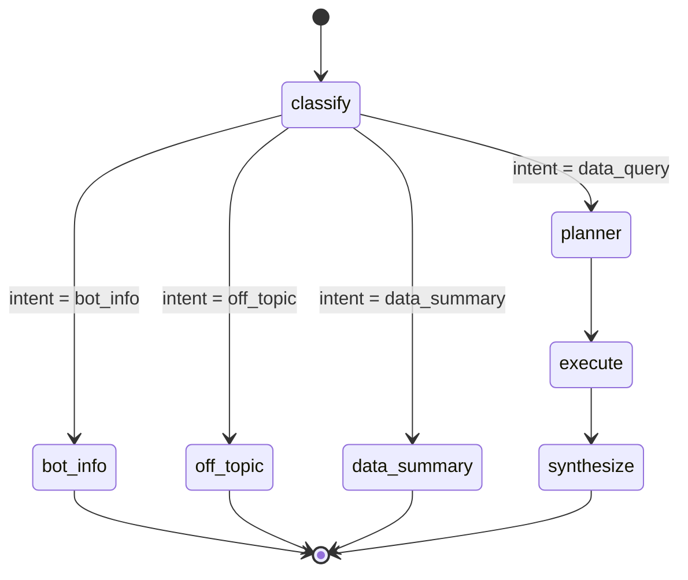
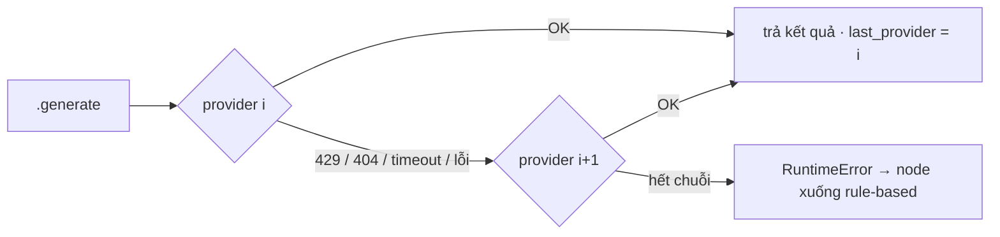

# Kiến trúc

Tài liệu này mô tả cách hệ thống biến một câu hỏi ngôn ngữ tự nhiên thành một
phân tích có thể kiểm chứng, và các cơ chế giữ cho nó **an toàn** và **đáng tin**.

## 1. Tổng quan



- **Một tiến trình** phục vụ cả API lẫn UI đã build (`/` → `dist/index.html`, `/api/*` → routers). SPA fallback `GET /{path}` **phải đăng ký cuối cùng**, sau mọi route `/api/*`.
- **SessionStore** là nguồn sự thật cho dữ liệu đang phân tích: cache LRU trong RAM (DataFrame + profile + quan hệ sheet), phần metadata bền hoá xuống DB, file gốc lưu ở `DATA_DIR`. Cache miss → khôi phục từ DB + nạp lại DataFrame từ disk.

## 2. Agent graph (LangGraph)



| Node | Vai trò | LLM? |
|---|---|---|
| `classify` | Phân loại câu hỏi (`query_classifier`, khớp cụm từ VI/EN) | Không |
| `bot_info` / `off_topic` | Trả lời hội thoại cố định, không đụng dữ liệu | Không |
| `data_summary` | Mô tả dataset từ profile | Không |
| `planner` | Sinh **plan JSON**; sửa tên cột mờ; validate với DataFrame; fallback rule‑based nếu hỏng | Có |
| `execute` | Chạy plan bằng pandas — **tất định, không LLM** | Không |
| `synthesize` | Viết brief tiếng Việt từ kết quả; kiểm tra grounding; fallback deterministic | Có |

`runner.stream_answer()` chạy `agent_graph.astream()` và phát sự kiện SSE:
`{type:"node"}` mỗi khi một node xong → `{type:"token"}` cắt câu trả lời theo từ → `{type:"done", charts, source, executed_queries}`.

`source` cuối cùng: `llm` | `fallback` (LLM synthesis hỏng) | `bot_info` | `off_topic`.

## 3. Safe tool‑calling: plan grammar

LLM **không bao giờ** chạm vào dữ liệu trực tiếp. Nó chỉ xuất một plan JSON được kiểm định 3 lớp trước khi thực thi.

**Grammar** (`analysis_planner.py`):

```
action        ∈ {aggregate, compare_metrics, time_series, profile, distribution}
aggregation   ∈ {sum, mean, median, min, max, count, nunique}
filter op     ∈ {eq, ne, gt, gte, lt, lte, between, in, contains}
derived op    ∈ {multiply, net_revenue_from_discount_pct, quarter, month, year, date}
source        (tùy chọn) = {"sheet": "<tên>"} | {"join": {base, with, on, how}}
```

**Ba lớp kiểm định** trước khi chạy:

1. `_remap_action_aliases` — chuẩn hoá tên action LLM hay nhầm.
2. `_repair_column_names` — khớp mờ tên cột LLM đưa về tên cột thật (bỏ dấu, viết tắt, gần đúng).
3. `_validate_plan_against_dataframe` — mọi cột tồn tại, kiểu phù hợp phép tính, action hợp lệ. Sai → ném lỗi → rơi xuống `build_fallback_plan` (suy luận từ câu hỏi bằng luật).

**Thực thi** (`execute_plan`): `df.copy()` → thêm cột dẫn xuất → lọc → nhánh theo action (`groupby/agg`, `pd.cut` cho distribution, resample cho time series…). Toàn bộ là pandas; không `eval`, không `exec`, không chuỗi SQL.

## 4. Cross‑sheet source resolution

Khi workbook có > 1 sheet, `planner` được cấp một "catalog" mô tả từng sheet + khoá join đã phát hiện, và có thể đặt field `source` trong plan:

```json
{"action":"aggregate",
 "source":{"join":{"base":"Orders","with":"Items","on":"order_id","how":"left"}},
 "group_by":["product_name"],
 "metrics":[{"column":"revenue","aggregation":"sum","label":"Doanh thu"}]}
```

`build_source_frame()` (trong `storage.py`) giải `source` thành DataFrame để chạy:

- chỉ join trên cột **có ở cả hai** sheet; `how` mặc định `left`;
- lỗi giải nghĩa bất kỳ → lùi về sheet đang active (câu hỏi vẫn chạy);
- nếu join làm số dòng phồng > 3× → trả kèm `join_warning`, hiển thị dạng banner ⚠️ trên câu trả lời (cảnh báo tính tổng/đếm có thể bị nhân lên).

`planner` validate plan với **frame đã join**, không phải sheet active.

## 5. Chuỗi failover LLM

`get_llm_client()` trả về một `FailoverLLMClient` bọc danh sách provider **có thứ tự**:

```
gemini:gemini-3.5-flash-lite   (RPD 500 trên free tier — chủ lực)
gemini:gemini-3.8-flash        (RPD 20 — chất lượng cao hơn, khi lite lỗi/429)
gemini:gemini-3.6-flash
openrouter:nvidia/nemotron-3-super-120b-a12b:free
openrouter:google/gemma-4-31b-it:free
openrouter:nvidia/nemotron-3-ultra-550b-a55b:free
```

Mỗi lần gọi `generate` / `generate_insights` / `answer_question` **duyệt cả chuỗi**:



- Provider dựng **lazy**; provider thiếu key khi khởi tạo bị đánh dấu "chết" và không thử lại.
- `LLM_PROVIDER=gemini|openrouter` (hoặc header `X-LLM-Provider`) ghim một provider — vẫn failover giữa các model của provider đó.
- Header per‑request `X-GEMINI-Key` / `X-ANTHROPIC-Key` (từ Settings UI) dựng chuỗi riêng cho request, kèm chuỗi env làm lưới an toàn.
- Vì sao quan trọng: bản trước chọn provider **một lần theo việc có key hay không** rồi cache; một model bị gỡ (404) hoặc hết quota (429) khiến toàn bộ chat rơi thẳng xuống rule‑based. Giờ lỗi runtime mới là tín hiệu chuyển provider.

## 6. Grounding & fallback

`synthesize_node`:

1. Gọi LLM viết brief từ kết quả (`result_df`).
2. `_is_valid_synthesis` — không rỗng, không phải meta‑commentary ("dưới đây là…").
3. `_numbers_grounded` — **mọi con số trong câu trả lời phải xuất hiện trong `result_df`** (cho phép sai số làm tròn + một tập giá trị phụ với distribution).
4. Không đạt (2) hoặc (3) → dùng **câu tóm tắt tất định** dựng thẳng từ `result_df`, đặt `llm_synthesis_failed = True` (→ `source = "fallback"`, UI hiện badge "Deterministic").

Kết quả: LLM có thể diễn đạt, nhưng **không thể bịa số** mà lọt.

## 7. Dashboard tự sinh

`GET /api/dashboard/{id}`: LLM nhận profile dataset → xuất spec JSON `{domain, kpi_specs, chart_specs}` → backend chạy từng spec qua **cùng `execute_plan()`** → trả `KPICard[]` + `ChartSpec[]` chung. `ecommerce_columns` map cột theo heuristic (revenue, order_id, date…) và đoán nền tảng (Shopee/Lazada/Tiki/Amazon…) để chọn KPI phù hợp. Cache theo session, vô hiệu khi đổi sheet.

## 8. Persistence

| Thứ | Nơi lưu | Ghi chú |
|---|---|---|
| DataFrame, profile, quan hệ sheet | RAM (`SessionStore`, LRU 200, TTL 24h) | Khôi phục từ DB + disk khi cache miss |
| Metadata session (`owner_id`, `active_sheet`, `report_id`, profile…) | SQLite (`DATA_DIR/sessions.db`) hoặc Postgres | Migration cộng dồn ở `_migrate_sessions_columns` — **phải liệt kê mọi cột thêm sau bản đầu**, nếu không INSERT sẽ âm thầm hỏng trên DB cũ |
| File gốc, report Markdown, lịch sử chat | `DATA_DIR/{uploads,reports,history}` | Job dọn session cũ chạy mỗi giờ (`SESSION_TTL_DAYS`) |

## 9. Bản đồ code

```
backend/app/
  main.py                 app factory, CORS, mount static, SPA fallback (cuối)
  agents/
    graph.py              định nghĩa LangGraph
    runner.py             run() + stream_answer() (SSE)
    state.py              AgentState (TypedDict)
    nodes/                classify · plan · execute · synthesize · respond
  services/
    llm_service.py        FailoverLLMClient, chuỗi Gemini/OpenRouter, per-request key
    analysis_planner.py   plan grammar, validate, execute_plan, dựng chart
    analysis_intent.py    suy luận ý định grouped-metric (fallback)
    query_classifier.py   classify bot_info / off_topic / data_summary / data_query
    storage.py            SessionStore, build_source_frame, resolve_sheet_key
    multi_sheet_analyzer.py  phát hiện quan hệ giữa sheet
    profiler.py           hồ sơ dataset
    ecommerce_columns.py  map cột + đoán nền tảng cho dashboard
    security.py           chống SSRF / ReDoS / prompt injection ở ranh giới tin cậy
    reports.py            xuất Markdown
  api/routes/            upload · chat · sheets · dashboard · export · reports · sessions · health
  core/                  config (pydantic-settings) · auth (X-API-Key) · logging (+ LangSmith)
  database.py            SQLAlchemy models; init_db (lifespan) tạo bảng + thêm cột thiếu
frontend/src/main.tsx    toàn bộ UI (chat, preview, dashboard, sheets panel, settings)
tests/                   101 unit test + eval_100.py
```
