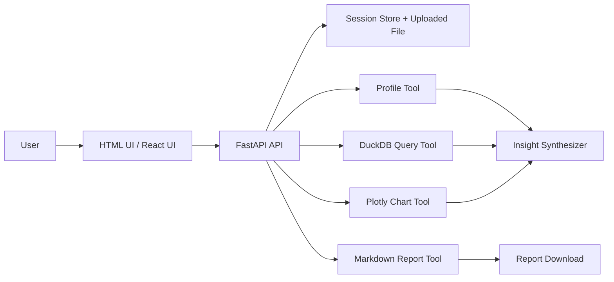
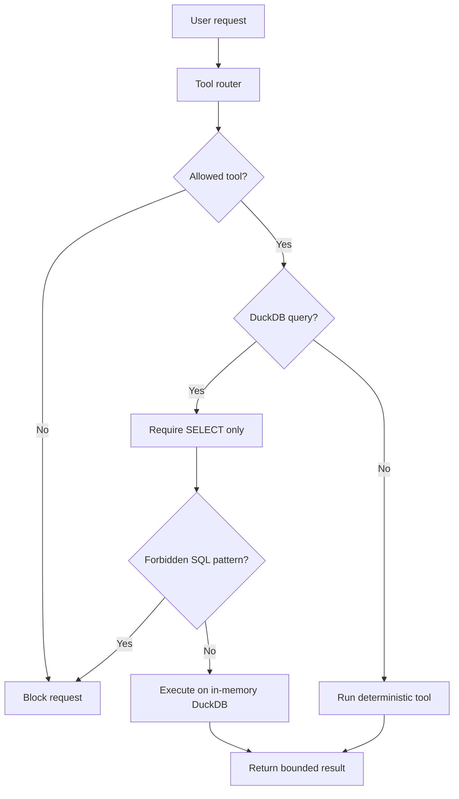

# Data Analysis AI Agent

MVP AI engineering project for uploading CSV/XLSX files and generating automatic dataset profiling, chart recommendations, natural-language insights, and Markdown reports.

The first implementation deliberately avoids arbitrary code execution. Instead, analysis actions go through a small set of whitelisted tools: profiler, read-only DuckDB query engine, chart generator, and report writer. This keeps the MVP safer and easier to evaluate than a free-form Python execution agent.

## MVP Scope

- Upload CSV/XLSX/XLS files up to 10MB.
- Profile rows, columns, dtypes, missing values, numeric stats, and top categorical values.
- Generate up to 3 recommended Plotly charts.
- Generate a natural-language insight summary.
- Ask simple dataset questions through read-only DuckDB SQL generation.
- Export Markdown report.
- Serve a no-build HTML demo UI from FastAPI at `/`.
- Include a React/Vite frontend scaffold for the polished UI track.

## Architecture



## Safety Model



## API

### Health

```http
GET /api/health
```

### Upload

```http
POST /api/upload
Content-Type: multipart/form-data
```

Returns `session_id` and dataset profile.

### Analyze

```http
POST /api/analyze
Content-Type: application/json

{
  "session_id": "...",
  "question": "Optional business question"
}
```

Returns insight text, profile, Plotly chart specs, report id, and guardrail notes.

### Chat

```http
POST /api/chat
Content-Type: application/json

{
  "session_id": "...",
  "question": "tổng sales là bao nhiêu?"
}
```

The MVP maps common questions to safe read-only DuckDB queries.

## Run Backend

```bash
python -m venv .venv
.venv\\Scripts\\activate
pip install -r requirements.txt
uvicorn backend.app.main:app --reload --port 8000
```

Open:

```text
http://localhost:8000
```

Swagger docs:

```text
http://localhost:8000/docs
```

## React Frontend Track

Node was not available in the initial local environment, so the source is scaffolded but not installed yet.

```bash
cd frontend
npm install
npm run dev
```

Vite proxies `/api` to `http://localhost:8000`.

## Verification

```bash
python -m compileall backend scripts
python scripts/smoke_test.py
```

## Roadmap

- Add LLM provider abstraction for insight synthesis.
- Add benchmark datasets and 20 evaluation questions.
- Add chart success-rate and latency metrics.
- Add PII detection and masking option.
- Add async job queue for larger files.
- Add PDF export after Markdown/HTML report stabilizes.

## CV Positioning

This project is designed to demonstrate:

- practical AI product thinking;
- safe tool-calling architecture;
- data profiling and analytics automation;
- backend API design with FastAPI;
- chart/report generation;
- evaluation-ready AI engineering workflow.

