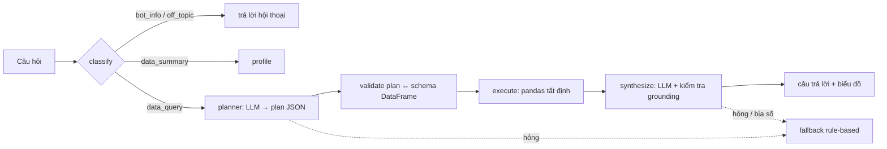

# Data Analysis AI Agent

[](https://github.com/luongducthangDS/data_analysis_ai_agent/actions/workflows/ci.yml)
[](LICENSE)

> Trò chuyện với file CSV/Excel bằng tiếng Việt. Một LLM agent **lập kế hoạch phân tích dưới dạng JSON đã kiểm định**, thực thi **tất định trên pandas**, rồi tổng hợp insight — **không thực thi code tùy ý, không sinh SQL tự do**.

`upload → hỏi bằng ngôn ngữ tự nhiên → nhận số liệu + biểu đồ + brief điều hành`

---

## Vì sao làm theo cách này

Text‑to‑analysis thường đi qua text‑to‑SQL hoặc sinh code Python. Cả hai đều mở ra rủi ro thực thi tùy ý, khó kiểm thử, và khó tin khi số liệu sai.

Ở dự án này, LLM **chỉ được phép sinh một "plan" JSON** trong một grammar hẹp:

```json
{"action":"aggregate","group_by":["region"],
 "metrics":[{"column":"revenue","aggregation":"sum","label":"Doanh thu"}],
 "sort":[{"column":"Doanh thu","direction":"desc"}],"limit":10}
```

Backend **validate plan với schema thật của DataFrame** (tên cột, kiểu dữ liệu, phép tính hợp lệ) rồi thực thi bằng pandas. Không có `eval`, `exec`, không có SQL. LLM hỏng → hệ thống rơi xuống **kế hoạch rule‑based**, không bao giờ crash.

## Năng lực AI‑engineering thể hiện

| Chủ đề | Chi tiết |
|---|---|
| **Agent orchestration** | Máy trạng thái LangGraph: `classify → {bot_info \| off_topic \| data_summary \| planner → execute → synthesize}`. Streaming từng node qua SSE. |
| **Độ tin cậy LLM** | Chuỗi failover tới 9 mắt xích — 3 model Gemini × số key khai báo → 3 model OpenRouter. Quota free tier tính theo cặp (key, model), nên hết quota thì **đổi key trên cùng model trước**, hạ model sau — giữ model tốt nhất lâu nhất. Lỗi runtime (429 / 404 / timeout) tự chuyển model kế; cạn chuỗi mới xuống rule‑based. |
| **Safe tool‑calling** | Whitelist action & aggregation, plan validate với DataFrame, thực thi pandas tất định trong "sandbox" thao tác. |
| **Grounding** | Câu tổng hợp bị **từ chối** nếu chứa con số không khớp kết quả tính (`_numbers_grounded`) → tránh bịa số. |
| **Evaluation** | `tests/eval_100.py` — 100 câu / 6 dataset, ground truth tính bằng pandas. Chiều cứng `correctness` (số ±10%) + 3 chiều mềm calibrate bằng nhãn tay **và** LLM-as-judge full-100. Kết quả mới nhất (2026-09-19): **86/100**, median latency 2.5s · p95 3.2s, 0/100 rơi về rule-based. Xem [`docs/EVALUATION.md`](docs/EVALUATION.md) — kèm phân tích vì sao **không** quy toàn bộ cải thiện cho một thay đổi. |
| **Observability** | `services/usage.py` đo token / chi phí / độ trễ từng lần gọi LLM và **quy về từng node** (`plan` chiếm 83% token, `synthesize` 17%), trả kèm trong response API. Eval báo cáo p95·p99 latency, `$/1.000 câu hỏi`, lỗi provider tách theo nguyên nhân. Chi phí chưa khai giá báo `n/a` thay vì `$0`. Không cần dịch vụ tracing ngoài. |
| **Routing eval** | `tests/test_routing.py` — đo bằng **macro-recall** chứ không phải accuracy, vì 85% câu là `data_query` nên accuracy trần che mất lỗi. Phát hiện `bot_info`/`off_topic` chỉ đúng 1/5; sửa bằng mẫu cấu trúc + tín hiệu dữ liệu phủ quyết → held-out macro-recall **33% → 100%**. |
| **Adversarial testing** | `tests/test_adversarial.py` — 18 đòn tấn công (SSRF / plan escape / prompt injection), chạy offline trong CI, chặn 18/18. Bộ này phát hiện và vá 4 lỗ hổng thật: SSRF ở import-from-URL, ReDoS ở filter `contains`, indirect prompt injection qua dữ liệu upload, `limit` không trần — chi tiết ở [`docs/EVALUATION.md`](docs/EVALUATION.md). |
| **Data hygiene** | `services/numeric_parse.py` đọc được cột tiền dạng chữ (`" $ (4,533.75) "` → −4533.75, định dạng châu Âu, `32.000.000 VNĐ`). Không có nó, `sum()` trên cột toàn `NaN` trả `0` và agent báo "Tổng lợi nhuận là 0". Bộ eval **cũng** dính lỗi này — ground truth cũ bỏ sót 63/700 dòng; nay cả hai dùng chung một bộ đọc số. |
| **Fuzzy column resolution** | LLM gọi sai tên cột (thiếu dấu, viết tắt) → resolver khớp mờ về tên thật trước khi validate. |
| **Multi‑sheet / multi‑file** | Tự phát hiện quan hệ giữa các sheet; planner sinh **cross‑sheet join**; cảnh báo fan‑out khi join 1‑nhiều làm phồng số dòng. |
| **Full‑stack** | FastAPI + React/Vite, dashboard tự sinh KPI theo domain, export CSV/Markdown, đóng gói Docker, health check. |

## Tính năng

- **Nhập dữ liệu**: kéo‑thả CSV / XLSX / XLS (nhiều file), hoặc dán URL (CSV public, Google Sheets "anyone with the link", Dropbox).
- **Hồ sơ dữ liệu**: số dòng/cột, kiểu, giá trị thiếu, thống kê số, top giá trị phân loại — sinh tự động khi upload.
- **Chat streaming**: hỏi "doanh thu theo vùng", "top 5 sản phẩm", "phân phối điểm", "xu hướng theo tháng"… → trả lời tiếng Việt + biểu đồ Plotly inline. Biểu đồ chỉ hiện khi có ý nghĩa.
- **Dashboard**: LLM đọc hồ sơ dữ liệu → tự quyết KPI + biểu đồ phù hợp domain (e‑commerce, tài chính, HR, sản xuất…).
- **Multi‑sheet**: chuyển sheet đang phân tích, gộp sheet, hỏi câu bắc cầu nhiều sheet.
- **Xuất**: tải lại dữ liệu đã xử lý (CSV) và báo cáo Markdown.
- **BYOK**: người dùng có thể nhập API key riêng (Gemini / Anthropic) trong Settings — key lưu ở trình duyệt.

## Quickstart

```bash
# 1. Backend
python -m venv .venv && .venv/Scripts/activate      # hoặc: source .venv/bin/activate
pip install -r requirements.txt
cp .env.example .env                                 # điền GEMINI_API_KEY (bắt buộc)

# 2. Frontend (một lần, để có bản build UI)
cd frontend && npm install && npm run build && cd ..

# 3. Chạy
uvicorn backend.app.main:app --port 8000
# → http://localhost:8000        (UI + API)
# → http://localhost:8000/docs   (Swagger)
```

Phát triển frontend: `cd frontend && npm run dev` (Vite proxy `/api` → :8000).

### Biến môi trường tối thiểu

```bash
GEMINI_API_KEY=...           # https://aistudio.google.com/apikey — bắt buộc
GEMINI_API_KEY2=...          # tùy chọn — nhân đôi quota free tier (15 req/phút mỗi key mỗi model)
OPENROUTER_API_KEY=...       # https://openrouter.ai/keys — tùy chọn, để có tầng dự phòng
```

Chuỗi model đổi được không cần sửa code: `GEMINI_MODELS=...`, `OPENROUTER_MODELS=...` (xem `.env.example`).

## Kiến trúc

Chi tiết ở **[ARCHITECTURE.md](ARCHITECTURE.md)**. Tóm tắt luồng một câu hỏi:


```mermaid
flowchart LR
    Q[Câu hỏi] --> C{classify}
    C -->|bot_info / off_topic| R[trả lời hội thoại]
    C -->|data_summary| P0[profile]
    C -->|data_query| PL[planner: LLM → plan JSON]
    PL --> V[validate plan ↔ schema DataFrame]
    V --> EX[execute: pandas tất định]
    EX --> SY[synthesize: LLM + kiểm tra grounding]
    SY --> A[câu trả lời + biểu đồ]
    PL -.hỏng.-> FB[fallback rule-based]
    SY -.hỏng / bịa số.-> FB
```

## Tech stack

**Backend** FastAPI · LangGraph · pandas · Plotly · SQLAlchemy · slowapi
**Frontend** React 18 · Vite · react‑plotly.js
**LLM** Google Gemini (chính) · OpenRouter (dự phòng, nhiều model) · tùy chọn Anthropic
**Hạ tầng** Docker (multi‑stage) · Railway / Render config · LangSmith tracing (tùy chọn)

## Kiểm thử

```bash
pytest -q                    # 201 test (agent, planner, storage, failover, guardrails, multi-sheet, adversarial, usage, routing)

python tests/test_adversarial.py   # in bảng block rate của bộ tấn công đối kháng

# eval end-to-end — cần server đang chạy + GEMINI_API_KEY
uvicorn backend.app.main:app --port 8000 &
python tests/eval_100.py --base-url http://localhost:8000 --delay 3 \
    --baseline docs/eval-baseline/summary.json    # kèm bảng regression

python tests/eval_100.py --rescore docs/eval-baseline/results.csv   # chấm lại run cũ, không cần server
python tests/eval_calibration.py                                     # heuristic vs nhãn tay
```

6 dataset eval nằm sẵn trong `data/samples/` (dữ liệu tổng hợp / mẫu công khai, không PII) — `eval_100.py` tự upload rồi chấm với ground truth tính bằng pandas. `--delay` giãn nhịp request để không đụng rate‑limit free tier.

**Kết quả baseline, calibration, và bug agent do eval phát hiện**: xem [`docs/EVALUATION.md`](docs/EVALUATION.md).

## Giới hạn (có chủ đích)

Đây là **dự án chứng minh năng lực AI‑engineering**, không phải sản phẩm thương mại:

- **Thực thi in‑memory bằng pandas** — dataset phải vừa RAM (phù hợp file ~vài chục MB). Dữ liệu lớn cần query‑engine đẩy xuống nguồn (DuckDB / SQL push‑down).
- **Auth cơ bản** (`X-API-Key`, mặc định mở cho dev) — chưa có tổ chức / multi‑tenant / RBAC.
- **Dữ liệu gửi tới LLM bên thứ ba** (Google, OpenRouter) — chưa có tùy chọn model self‑hosted.
- **Streaming "mỹ phẩm"** — câu trả lời tính xong mới cắt từng từ để hiển thị; chưa phải token‑streaming thật từ LLM.

## Tác giả

**Luong Duc Thang** — [GitHub @luongducthangDS](https://github.com/luongducthangDS) · luongducthang289@gmail.com

Góp ý / báo lỗi: mở [issue](https://github.com/luongducthangDS/data_analysis_ai_agent/issues).

## Giấy phép

[MIT](LICENSE) © 2026 Luong Duc Thang
