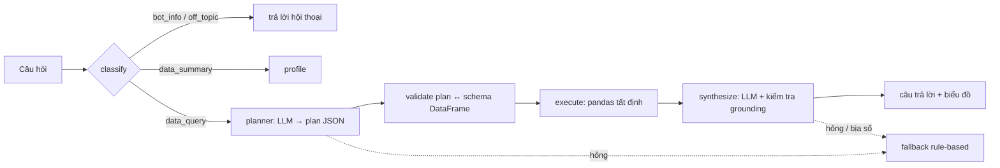

# Data Analysis AI Agent

> Trò chuyện với file CSV/Excel bằng tiếng Việt. Một LLM agent **lập kế hoạch phân tích dưới dạng JSON đã kiểm định**, thực thi **tất định trên pandas**, rồi tổng hợp insight — **không thực thi code tùy ý, không sinh SQL tự do**.

`upload → hỏi bằng ngôn ngữ tự nhiên → nhận số liệu + biểu đồ + brief điều hành`

---

## Vì sao làm theo cách này

Text‑to‑analysis thường đi qua text‑to‑SQL hoặc sinh code Python. Cả hai đều mở ra rủi ro thực thi tùy ý, khó kiểm thử, và khó tin khi số liệu sai.

Ở dự án này, LLM **chỉ được phép sinh một "plan" JSON** trong một grammar hẹp:

```json
{"action":"aggregate","group_by":["region"],
 "metrics":[{"column":"revenue","aggregation":"sum","label":"Doanh thu"}],
 "sort":[{"column":"Doanh thu","direction":"desc"}],"limit":10}
```

Backend **validate plan với schema thật của DataFrame** (tên cột, kiểu dữ liệu, phép tính hợp lệ) rồi thực thi bằng pandas. Không có `eval`, `exec`, không có SQL. LLM hỏng → hệ thống rơi xuống **kế hoạch rule‑based**, không bao giờ crash.

## Năng lực AI‑engineering thể hiện

| Chủ đề | Chi tiết |
|---|---|
| **Agent orchestration** | Máy trạng thái LangGraph: `classify → {bot_info \| off_topic \| data_summary \| planner → execute → synthesize}`. Streaming từng node qua SSE. |
| **Độ tin cậy LLM** | Chuỗi failover 6 mắt xích — 3 model Gemini (`flash-lite → flash`) → 3 model OpenRouter. Lỗi runtime (429 / 404 / timeout) tự chuyển model kế; cạn chuỗi mới xuống rule‑based. |
| **Safe tool‑calling** | Whitelist action & aggregation, plan validate với DataFrame, thực thi pandas tất định trong "sandbox" thao tác. |
| **Grounding** | Câu tổng hợp bị **từ chối** nếu chứa con số không khớp kết quả tính (`_numbers_grounded`) → tránh bịa số. |
| **Evaluation** | `tests/eval_100.py` — 100 câu hỏi / 6 dataset, chấm `correctness`, `relevance`, `lang_quality`, `latency`, tỉ lệ rơi fallback. |
| **Fuzzy column resolution** | LLM gọi sai tên cột (thiếu dấu, viết tắt) → resolver khớp mờ về tên thật trước khi validate. |
| **Multi‑sheet / multi‑file** | Tự phát hiện quan hệ giữa các sheet; planner sinh **cross‑sheet join**; cảnh báo fan‑out khi join 1‑nhiều làm phồng số dòng. |
| **Full‑stack** | FastAPI + React/Vite, dashboard tự sinh KPI theo domain, export CSV/Markdown, đóng gói Docker, health check. |

## Tính năng

- **Nhập dữ liệu**: kéo‑thả CSV / XLSX / XLS (nhiều file), hoặc dán URL (CSV public, Google Sheets "anyone with the link", Dropbox).
- **Hồ sơ dữ liệu**: số dòng/cột, kiểu, giá trị thiếu, thống kê số, top giá trị phân loại — sinh tự động khi upload.
- **Chat streaming**: hỏi "doanh thu theo vùng", "top 5 sản phẩm", "phân phối điểm", "xu hướng theo tháng"… → trả lời tiếng Việt + biểu đồ Plotly inline. Biểu đồ chỉ hiện khi có ý nghĩa.
- **Dashboard**: LLM đọc hồ sơ dữ liệu → tự quyết KPI + biểu đồ phù hợp domain (e‑commerce, tài chính, HR, sản xuất…).
- **Multi‑sheet**: chuyển sheet đang phân tích, gộp sheet, hỏi câu bắc cầu nhiều sheet.
- **Xuất**: tải lại dữ liệu đã xử lý (CSV) và báo cáo Markdown.
- **BYOK**: người dùng có thể nhập API key riêng (Gemini / Anthropic) trong Settings — key lưu ở trình duyệt.

## Quickstart

```bash
# 1. Backend
python -m venv .venv && .venv/Scripts/activate      # hoặc: source .venv/bin/activate
pip install -r requirements.txt
cp .env.example .env                                 # điền GEMINI_API_KEY (bắt buộc)

# 2. Frontend (một lần, để có bản build UI)
cd frontend && npm install && npm run build && cd ..

# 3. Chạy
uvicorn backend.app.main:app --port 8000
# → http://localhost:8000        (UI + API)
# → http://localhost:8000/docs   (Swagger)
```

Phát triển frontend: `cd frontend && npm run dev` (Vite proxy `/api` → :8000).

### Biến môi trường tối thiểu

```bash
GEMINI_API_KEY=...           # https://aistudio.google.com/apikey — bắt buộc
OPENROUTER_API_KEY=...       # https://openrouter.ai/keys — tùy chọn, để có tầng dự phòng
```

Chuỗi model đổi được không cần sửa code: `GEMINI_MODELS=...`, `OPENROUTER_MODELS=...` (xem `.env.example`).

## Kiến trúc

Chi tiết ở **[ARCHITECTURE.md](ARCHITECTURE.md)**. Tóm tắt luồng một câu hỏi:


```mermaid
flowchart LR
    Q[Câu hỏi] --> C{classify}
    C -->|bot_info / off_topic| R[trả lời hội thoại]
    C -->|data_summary| P0[profile]
    C -->|data_query| PL[planner: LLM → plan JSON]
    PL --> V[validate plan ↔ schema DataFrame]
    V --> EX[execute: pandas tất định]
    EX --> SY[synthesize: LLM + kiểm tra grounding]
    SY --> A[câu trả lời + biểu đồ]
    PL -.hỏng.-> FB[fallback rule-based]
    SY -.hỏng / bịa số.-> FB
```

## Tech stack

**Backend** FastAPI · LangGraph · pandas · Plotly · SQLAlchemy · slowapi
**Frontend** React 18 · Vite · react‑plotly.js
**LLM** Google Gemini (chính) · OpenRouter (dự phòng, nhiều model) · tùy chọn Anthropic
**Hạ tầng** Docker (multi‑stage) · Railway / Render config · LangSmith tracing (tùy chọn)

## Kiểm thử

```bash
pytest -q                    # 101 unit test (agent, planner, storage, failover, guardrails, multi-sheet)
python tests/eval_100.py     # eval framework — cần server đang chạy
```

6 dataset eval nằm sẵn trong `data/samples/` (dữ liệu tổng hợp / mẫu công khai, không PII) — `eval_100.py` tự upload rồi chấm với ground truth tính bằng pandas.

## Giới hạn (có chủ đích)

Đây là **dự án chứng minh năng lực AI‑engineering**, không phải sản phẩm thương mại:

- **Thực thi in‑memory bằng pandas** — dataset phải vừa RAM (phù hợp file ~vài chục MB). Dữ liệu lớn cần query‑engine đẩy xuống nguồn (DuckDB / SQL push‑down).
- **Auth cơ bản** (`X-API-Key`, mặc định mở cho dev) — chưa có tổ chức / multi‑tenant / RBAC.
- **Dữ liệu gửi tới LLM bên thứ ba** (Google, OpenRouter) — chưa có tùy chọn model self‑hosted.
- **Streaming "mỹ phẩm"** — câu trả lời tính xong mới cắt từng từ để hiển thị; chưa phải token‑streaming thật từ LLM.
