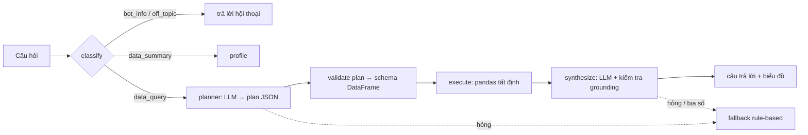

# SellerLens

[English](README.md) · **Tiếng Việt**

[](https://github.com/luongducthangDS/data_analysis_ai_agent/actions/workflows/ci.yml)
[](LICENSE)

> **Trợ lý phân tích lợi nhuận và vận hành cho shop bán hàng đa sàn (Shopee, TikTok Shop).**
> Tải file export của sàn cùng bảng giá vốn, rồi hỏi bằng tiếng Việt: *lãi thật theo SKU/kênh/tháng là bao nhiêu, phí sàn ăn bao nhiêu phần trăm, vì sao tháng này lãi giảm, nên kiểm tra gì trước.*

`export sàn + bảng giá vốn → chuẩn hoá & cảnh báo dữ liệu thiếu → hỏi → số liệu + nguyên nhân + việc nên kiểm tra`

Người dùng mục tiêu: chủ shop nhỏ và vừa bán trên 2 sàn trở lên. Họ có file export nhưng không biết mình **lãi thật** bao nhiêu sau phí sàn, giá vốn, hoàn hàng và quảng cáo.

## Luồng chính: từ file export đến quyết định

1. **Nạp dữ liệu.** Nhận diện file export Shopee/TikTok qua header gốc và đổi sang schema chung ([`ecommerce_semantic.py`](backend/app/services/ecommerce_semantic.py)). Giá vốn được ghép từ bảng `sku, gia_von`.
2. **Tính metric tiền ở một chỗ.** `doanh_thu_thuan`, `phi_san` (hoa hồng + thanh toán + voucher/freeship + dịch vụ + thuế khấu trừ) và `loi_nhuan_truoc_qc` được tính tất định lúc nạp file. LLM chỉ cộng các cột này, không tự ghép công thức.
3. **Cảnh báo trước khi trả lời.** SKU không có giá vốn thì lãi bị tính cao hơn thực tế, và câu trả lời phải nói rõ điều này.
4. **Hỏi đáp.** Lãi/lỗ theo SKU, kênh, tháng; tỷ lệ phí sàn; SKU doanh thu cao nhưng lỗ.
5. **Vì sao lãi đổi → nên làm gì.** Hỏi "vì sao lãi tháng 5 giảm" thì action `profit_bridge` tách phần lãi chênh giữa 2 kỳ thành doanh thu, phí sàn, giá vốn và hoàn hàng (cộng lại khớp tuyệt đối), tách riêng phần lãi mất vì *tỷ lệ* phí tăng, rồi chỉ ra kênh/SKU (hoặc tỉnh × đơn vị vận chuyển) kéo lãi xuống. Sau đó là danh sách **việc nên kiểm tra** sinh theo luật cố định, không do LLM nghĩ ra. Ví dụ: "tỷ lệ phí 33,5% → 36,5% làm lãi giảm 13,3 triệu; cần tăng giá ~4,7% để giữ tiền về", "Nghệ An × J&T đang lỗ, hoàn tăng". Được test với đáp án kịch bản S1 và S4 ([`test_ecommerce_semantic.py`](tests/test_ecommerce_semantic.py)).

Dữ liệu demo [`data/samples/shop_lan/`](data/samples/shop_lan/) là **dữ liệu mô phỏng** ("shop Chị Lan", 12.000 đơn, 6 tháng). Tham số phí lấy từ báo chí về biểu phí sàn; tỷ lệ đơn Shopee/TikTok (64/36) theo thị phần Q1/2025 của Metric.vn. **Không phải dữ liệu của shop thật**. Bộ này có 4 kịch bản cài sẵn kèm đáp án (`ground_truth.json`): sàn tăng phí từ tháng 5, SKU bán chạy nhưng lỗ, quảng cáo TikTok tăng vọt tuần 23, tỷ lệ hoàn tăng ở một tỉnh × đơn vị vận chuyển.

Thiếu dữ liệu thì từ chối, không đoán: chưa có giá vốn → câu hỏi về lãi được trả lời "chưa tính được lãi" kèm file mẫu giá vốn; thiếu giá vốn một phần → mọi câu trả lời về lãi kèm cảnh báo. Có file quảng cáo (`ngay, kenh, chi_phi_qc`) → quảng cáo được chia về từng đơn theo doanh thu trong ngày × kênh để ra lãi ròng (`loi_nhuan_rong`; theo tháng/kênh là số thật, theo SKU/tỉnh là ước tính). Đo bằng [`tests/eval_seller.py`](tests/eval_seller.py): 25 câu × 3 cách nạp, lần chạy gần nhất 25/25, 0 số sai trông như đúng.

Chưa có (theo thứ tự ưu tiên): màn hình xác nhận mapping cột, xử lý VAT và thời điểm ghi nhận doanh thu theo đối soát sàn, chi phí hàng hoàn bị hỏng (file export sàn không có).

---

## Vì sao làm theo cách này

Text‑to‑analysis thường đi qua text‑to‑SQL hoặc sinh code Python. Cả hai đều mở ra rủi ro thực thi tùy ý, khó kiểm thử, và khó tin khi số liệu sai.

Ở dự án này, LLM **chỉ được phép sinh một "plan" JSON** trong một grammar hẹp:

```json
{"action":"aggregate","group_by":["region"],
 "metrics":[{"column":"revenue","aggregation":"sum","label":"Doanh thu"}],
 "sort":[{"column":"Doanh thu","direction":"desc"}],"limit":10}
```

Backend **validate plan với schema thật của DataFrame** (tên cột, kiểu dữ liệu, phép tính hợp lệ) rồi thực thi bằng pandas. Không có `eval`, `exec`, không có SQL. LLM hỏng → hệ thống rơi xuống **kế hoạch rule‑based**, không bao giờ crash.

## Chi tiết kỹ thuật

Orchestration, failover LLM, grounding, eval, adversarial testing, observability: xem [`docs/ENGINEERING.md`](docs/ENGINEERING.md).

## Tính năng

Lõi phân tích vẫn đọc được file CSV/Excel bất kỳ, nên các tính năng tổng quát dưới đây vẫn giữ. Nhưng bộ metric, cảnh báo và kịch bản eval chỉ được làm sâu cho dữ liệu bán hàng đa sàn.

- **Nhập dữ liệu**: kéo‑thả CSV / XLSX / XLS (nhiều file), hoặc dán URL (CSV public, Google Sheets "anyone with the link", Dropbox).
- **Hồ sơ dữ liệu**: số dòng/cột, kiểu, giá trị thiếu, thống kê số, top giá trị phân loại — sinh tự động khi upload.
- **Chat streaming**: hỏi "doanh thu theo vùng", "top 5 sản phẩm", "phân phối điểm", "xu hướng theo tháng"… → trả lời tiếng Việt + biểu đồ Plotly inline. Biểu đồ chỉ hiện khi có ý nghĩa.
- **Dashboard**: LLM đọc hồ sơ dữ liệu → tự quyết KPI + biểu đồ phù hợp domain (e‑commerce, tài chính, HR, sản xuất…).
- **Multi‑sheet**: chuyển sheet đang phân tích, gộp sheet, hỏi câu bắc cầu nhiều sheet.
- **Xuất**: tải lại dữ liệu đã xử lý (CSV) và báo cáo Markdown.
- **BYOK**: người dùng có thể nhập API key riêng (Gemini / Anthropic) trong Settings — key lưu ở trình duyệt.

## Quickstart

### Docker (một lệnh)

```bash
cp .env.example .env        # điền GEMINI_API_KEY (miễn phí: https://aistudio.google.com/apikey)
docker compose up --build
# → http://localhost:8000
```

Thử ngay với dữ liệu mô phỏng: upload `data/samples/shop_lan/shop_lan_orders.csv` rồi hỏi *"vì sao lãi tháng 5 giảm?"*. Muốn thử đúng luồng file export thật thì upload cùng lúc `export_shopee.csv` + `products.csv` (bảng giá vốn).

### Chạy không cần Docker

```bash
# 1. Backend
python -m venv .venv && .venv/Scripts/activate      # hoặc: source .venv/bin/activate
pip install -r requirements-dev.txt
cp .env.example .env                                 # điền GEMINI_API_KEY (bắt buộc)

# 2. Frontend (một lần, để có bản build UI)
cd frontend && npm install && npm run build && cd ..

# 3. Chạy
uvicorn backend.app.main:app --port 8000
# → http://localhost:8000        (UI + API)
# → http://localhost:8000/docs   (Swagger)
```

Phát triển frontend: `cd frontend && npm run dev` (Vite proxy `/api` → :8000).

### Biến môi trường tối thiểu

```bash
GEMINI_API_KEY=...           # https://aistudio.google.com/apikey — bắt buộc
GEMINI_API_KEY2=...          # tùy chọn — nhân đôi quota free tier (15 req/phút mỗi key mỗi model)
OPENROUTER_API_KEY=...       # https://openrouter.ai/keys — tùy chọn, để có tầng dự phòng
```

Chuỗi model đổi được không cần sửa code: `GEMINI_MODELS=...`, `OPENROUTER_MODELS=...` (xem `.env.example`).

## Kiến trúc

Chi tiết ở **[ARCHITECTURE.md](ARCHITECTURE.md)**. Tóm tắt luồng một câu hỏi:



## Tech stack

**Backend** FastAPI · LangGraph · pandas · Plotly · SQLAlchemy · slowapi
**Frontend** React 18 · Vite · react‑plotly.js
**LLM** Google Gemini (chính) · OpenRouter (dự phòng, nhiều model) · tùy chọn Anthropic
**Hạ tầng** Docker (multi‑stage) · Railway / Render config · LangSmith tracing (tùy chọn)

## Kiểm thử

```bash
pytest -q                    # 248 test (agent, planner, storage, failover, guardrails, multi-sheet, adversarial, usage, routing)

python tests/test_adversarial.py   # in bảng block rate của bộ tấn công đối kháng

# eval end-to-end — cần server đang chạy + GEMINI_API_KEY
uvicorn backend.app.main:app --port 8000 &
python tests/eval_100.py --base-url http://localhost:8000 --delay 3 \
    --baseline docs/eval-baseline/summary.json    # kèm bảng regression

python tests/eval_100.py --rescore docs/eval-baseline/results.csv   # chấm lại run cũ, không cần server
python tests/eval_calibration.py                                     # heuristic vs nhãn tay
```

6 dataset eval nằm sẵn trong `data/samples/` (dữ liệu tổng hợp / mẫu công khai, không PII) — `eval_100.py` tự upload rồi chấm với ground truth tính bằng pandas. `--delay` giãn nhịp request để không đụng rate‑limit free tier.

**Kết quả baseline, calibration, và bug agent do eval phát hiện**: xem [`docs/EVALUATION.md`](docs/EVALUATION.md).

## Đánh giá: đọc số thế nào

Run gần nhất 2026-09-19 ([`summary-20260919.json`](docs/eval-baseline/summary-20260919.json)). Mỗi chiều đo một thứ khác nhau, **không gộp thành một con số**:

| Chiều | Kết quả | Mức tin cậy |
|---|---|---|
| **Độ đúng số liệu** (`correctness`) | 0.79 trung bình trên 53 câu có đáp án đơn trị | Cao: so với ground truth tính bằng pandas |
| **Đúng ý định câu hỏi** (định tuyến) | macro-recall 100% trên tập held-out nhỏ ([`test_routing.py`](tests/test_routing.py)) | Trung bình: tập held-out ít câu |
| **Chất lượng insight** | 0.86 theo heuristic | **Thấp**: heuristic chỉ tương quan r = 0.33 với LLM-as-judge |
| **Độ trễ** | median 2.5 s · p95 3.2 s · p99 4.1 s | Cao, nhưng đo trên máy dev, free tier |
| **Chi phí** | chưa có: 183/187 lần gọi thuộc model chưa khai giá | Báo `n/a` thay vì `$0` |

"86/100 câu đạt" là điểm tổng có trọng số của các chiều trên, dùng để **bắt regression giữa các lần sửa**, không phải cam kết độ chính xác sản phẩm. Bộ câu hỏi do chính tác giả viết trên 6 dataset mẫu, chưa có câu hỏi thật từ chủ shop.

## Giới hạn (có chủ đích)

Đây là **MVP / portfolio**, chưa chạy với shop thật:

- **Dữ liệu bán hàng là dữ liệu nhạy cảm.** Hiện có: phiên và file upload tự xoá sau `SESSION_TTL_DAYS` (mặc định 7 ngày), xoá ngay qua `DELETE /api/session/{id}`, key BYOK chỉ lưu ở trình duyệt. **Chưa có:** mã hoá file lưu trên đĩa, cam kết log không chứa dữ liệu thô. Bật LangSmith tracing thì prompt (gồm tên cột và giá trị mẫu) sẽ được gửi sang LangSmith.
- **Thực thi in‑memory bằng pandas** — dataset phải vừa RAM (phù hợp file ~vài chục MB, tức vài năm đơn của một shop nhỏ). Khi cần file lớn hơn thì chuyển sang DuckDB.
- **Auth cơ bản** (`X-API-Key`, mặc định mở cho dev) — chưa có tổ chức / multi‑tenant / RBAC.
- **Dữ liệu gửi tới LLM bên thứ ba** (Google, OpenRouter) — chưa có tùy chọn model self‑hosted.
- **Streaming "mỹ phẩm"** — câu trả lời tính xong mới cắt từng từ để hiển thị; chưa phải token‑streaming thật từ LLM.

## Tác giả

**Luong Duc Thang** — [GitHub @luongducthangDS](https://github.com/luongducthangDS) · luongducthang289@gmail.com

Góp ý / báo lỗi: mở [issue](https://github.com/luongducthangDS/data_analysis_ai_agent/issues).

## Giấy phép

[MIT](LICENSE) © 2026 Luong Duc Thang
